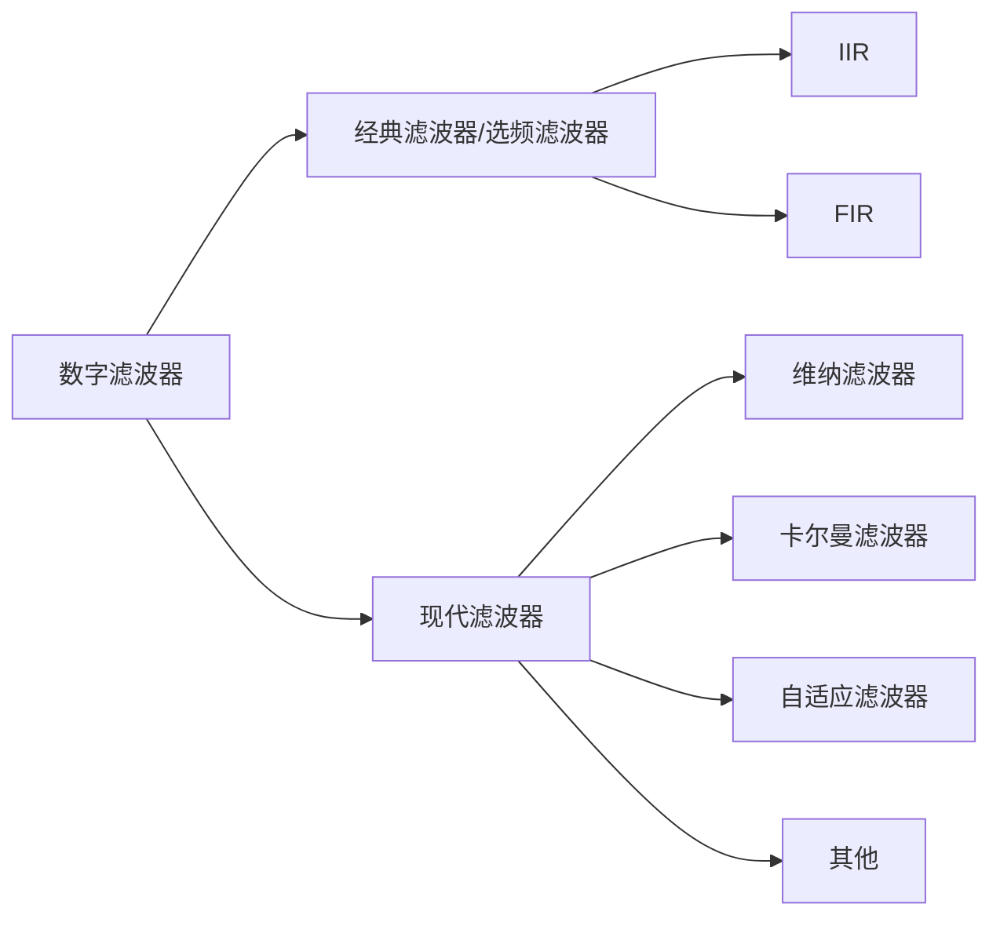

# 创作声明

本文档包含 2022~2023 秋季学期西北工业大学电子信息学院开设的数字信号处理课程（U08M11008）口试题目和笔者整理出的答案。

感谢李京华老师和数字信号处理授课团队的各位老师对本课程的支持和指导，他们精心准备的课程让我们更好地掌握了相关知识。

本文档主要由电子信息学院2020级本科生敖冠舒同学完成，同时2022硕士生王华元同学、2020级本科生王豪同学、2020级本科生闫康同学也参与了校对和修改工作。

限于时间和编者水平的限制，本文档难免出现纰漏和错误，欢迎联系 [guanshu_ao@mail.nwpu.edu.cn](mailto:guanshu_ao@mail.nwpu.edu.cn) 批评指正。

同时，笔者将相关课程资料上传至网址 https://github.com/guanshuao/NWPU_DSP，力求帮助到有需要的人。

希望我们的努力能提供一份绵薄之力。

2022.12

于长安校区

# **第 2 章**

**1.  模拟信号、离散时间信号和数字信号三者的特点分别是什么？**

模拟信号：自变量和函数都取连续值的信号（自然世界信号）；

离散时间信号：自变量取离散值，函数取连续值的信号（DSP 信号模型）；

数字信号：自变量取离散值，函数值量化的信号（ADC 转换后的信号，实际 DSP 系统处理的信号）。

**2.  数字信号和离散时间信号的区别是什么？**

离散时间信号：自变量取离散值，函数取连续值（DSP 信号模型）；

数字信号：自变量取离散值，函数值量化（ADC 转换后的信号，实际 DSP 系统处理的信号）；

前者的幅度是连续的，后者的幅度是离散的。

**3.  离散时间信号 $x(n)$ 的 $n$ 下标如何表示时间？**

实际上离散时间信号表示为：$x(nT)$，$n$ 取整数。

由于离散时间点的间隔均匀为 $T$，为了简化，$T$ 可以不写，形成信号 $x(n)$。

$x(n)$ 代表第 $n$ 个序列值，表示具体时间时再用 $n$ 乘采样间隔 $T$ 即可。

**4.  DSP 系统中常见的三种基本运算是什么？**

加法、数乘、移位

**5.  DSP 的延时是怎么实现的？**

延时是指在信号处理过程中，将信号**暂时存储**并延迟传送到输出端的过程。在 DSP 系统中，延时通常是通过使用称为“延时线性滤波器”的算法来实现的。该算法将信号的每个采样点存储在一个缓冲区中，并通过逐个重新排列这些采样点来实现延时。例如，如果要对信号进行 1 秒的延时，那么在缓冲区中的第 1 个采样点将在 1 秒后被输出到输出端。具体实现方式因 DSP 系统而异，有些 DSP 系统可能使用其他算法来实现延时，但延时线性滤波器是最常用的方法。

**6.  非时变系统的特点是什么？**

系统的输出不取决于输入信号何时加入系统，只取决于输入信号本身的内容。只要输入 $x(n)$ 是相同的，无论何时进行激励，输出 $y(n)$ 总是相同的。

（线性系统的特点：符合叠加性和齐次性）

**7.  系统一般因果性的概念是什么？**

若一个离散时间系统在任意时刻的输出,只与该时刻或该时刻之前的输入有关，而与该时刻后的输入没有关系，则称此系统为因果系统。

**8.  系统一般稳定性的概念是什么？**

对于一个系统，若对于每一个有界输入都产生有界输出，则称之为稳定系统

**9.  线性非时变系统（LTI 或 LSI）输入和输出的时域关系是什么？**
$$
y(n) = x(n)*h(n)=\sum_{k=-\infty}^{+\infty}{x(k)·h(n-k)}
$$
**10.  LTI 系统的单位冲激响应 $h(n)$ 如何表述它的因果性和稳定性？**
$$
因果性:当\space n<0 \space时,h(n)=0\\
稳定性:S=\sum_{n=-\infty}^{+\infty}{\lvert h(n) \rvert}<\infty
$$
**11.  非因果系统能实现吗？为什么？**

在实时处理意义下的系统是不可实现的，但后处理系统通过移位是可以实现的。且非因果性越强，延时越大。

**12.  LTI 系统卷积的物理意义是什么？**

表示 LTI 系统对输入信号进行处理的一种通用的数学表达式，是对输入信号处理方式和处理规则.

**13.  一个模拟低通带限信号进行采样时，理论上不失真的最低采样频率等于什么？**

信号最高频率 $f_{max}$ 的二倍即 $2f_{max}$，这个条件可以表示为：
$$
f_s\geq2f{max}
\quad
或
\quad
T_s\leq\frac{1}{2f_{max}}
$$
**14.  模拟信号被采样以后，它的频域怎样变化？**

离散时间信号的频谱是采样前连续信号频谱以采样频率为周期进行无限项周期延拓的结果，频谱幅度变为原来幅度的 $\frac {1}{T}$

**15. 实际中采样模拟信号用什么器件实现？它的输出是离散时间信号还是数字信号？**

模数转换器 ADC（Analog-to-Digital Converter）；数字信号。

**16. 一个模拟信号的频率 $f$ 和它采样后序列频率 $\omega$ 的关系是什么？**
$$
\omega
=\Omega·T_s
=\frac{\Omega}{f_s}
=2\pi f·T_s
=\frac {2\pi f}{f_s}
$$
$\omega$ 为数字频率，$\Omega$ 为模拟频率，$T_s$ 为采样间隔，$f_s$ 为采样频率。可以看到，数字频率 $\omega$ 是 $f$ 对 $f_s$ 的**归一化角频率**。

**17. DAC 能实现数字信号到模拟信号的理想重构吗？为什么？**

不能

DAC 将数字信号转换成模拟信号，是一种近似的信号重构。数字信号到模拟信号的理想重构是一个理想的低通滤波器，而 DAC 实现的是非理想的低通滤波器。

**18. 理论上离散时间信号重构模拟信号的最佳内插函数是哪一个函数？**
$$
\varphi_k(t)~=~Sa[\frac{\pi}{T}(t-kT)]~=~\frac{sin[\frac{\pi}{T}(t-kT)]}{\frac{\pi}{T}(t-kT)}
$$

这个函数被称为辛格函数。

# **第 3 章**

**1. LTI 系统对正弦序列的响应有什么特点？**

设输入$~x(n)=Ae^{j \omega n}$,输出为 $y(n)$
$$
y(n)
=H(e^{j\omega})Ae^{j \omega n }
=\lvert H(e^{j\omega}) \rvert · A·e^{j(\omega n + arg[H(e^{j\omega})] )}
=H(e^{j\omega})·x(n)
$$

$$
H(e^{j\omega})=\sum_{k=-∞}^{+∞}{h(k)·e^{-j\omega k}}
$$

LTI 系统对正弦序列的响应输出，仍是一个相同频率的正弦序列，变化的是幅度和相位，幅度由幅频响应改变，相位由相频响应改变。

**2. LTI 系统幅频响应的物理意义是什么？**

各频率分量通过系统后各个频率分量信号的幅度增益情况。

**3. LTI 系统相频响应的物理意义是什么？**

各频率分量通过系统后各个频率分量信号的相位改变情况（或时间上的延时情况）。

**4. 序列傅里叶变换 DTFT 的定义式什么？**
$$
X(e^{j\omega})=\sum_{n=-\infty}^{+\infty}{x(n)·e^{-j\omega n}}
$$

$$
x(n)=\frac{1}{2\pi}\int_{-\pi}^{\pi}{X(e^{j\omega})e^{j\omega n}d\omega}
$$

**5. 序列傅里叶变换 DTFT 是信号的频谱，频谱的物理概念是什么？**

时域序列所包含的不同频率正弦分量的幅度和相位分布。

**6. 序列频谱（DTFT）是周期函数吗？周期等于多少？**

是周期函数，周期为 $2\pi$。

**7. 一个实数序列的频谱 DTFT，它的对称性是什么？**

若 $x(n)=x^*(n)$ 即 $x(n)$ 为实数序列，则 $X(e^{j\omega})$ 共轭偶对称，
$$
X(e^{j\omega})=X^*(e^{-j\omega})
$$
**8. DTFT 频谱在一个周期 [0,2π] 内的负频率范围是什么？一个频谱在一个周期 [0,2π] 最高频率点为多少？**

$[\pi,2\pi]$，$\pi$

**9. 为什么要对信号进行傅里叶变换？它比时域分析好在哪里？**

在时域中，信号可能很难理解和处理，但是在频域中，它们的特性可以更容易地描述和分析。因此，通过对信号进行傅里叶变换，可以更容易地研究信号的频率和时间属性，并且可以用来进行滤波和调制等操作。此外，傅里叶变换还可以用来将信号从时域转换到频域，更加方便地分析信号的频率特性和能量分布，从而使得这些信号更容易进行通信或存储。

**10. LTI 系统的频域描述关系式是什么？**
$$
Y(e^{j\omega})=X(e^{j\omega})·H(e^{j\omega})
$$
**11. LTI 系统的频率响应函数和单位冲激响应的关系是什么？**

在频率响应是单位冲激响应的离散时间傅立叶变换 （DTFT），即
$$
H(e^{j\omega})=\sum_{n=-\infty}^{+\infty}{h(n)·e^{-j\omega n}}
$$
**12. 系统幅频响应的物理意义是什么？**

系统对不同频率的输入信号幅度的改变。

**13. 系统相频响应的物理意义是什么？**

系统对不同频率的输入信号相位的改变。

**14. 一个序列的 Z 变换与 DTFT 的关系是什么？**

当 H(z)的收敛域包含单位圆时：
$$
H(e^{j\omega})=H(z)|_{z=e^{j\omega}}
$$
**15. 与傅里叶变换相比，$z$ 变换的优点是什么？**

一个序列的 $z$ 变换存在的条件要比它的 DTFT 存在条件宽松，容易满足；分析的区域得到扩大；数学表示方面更简洁，简单直接地说明系统的特性。

**16. Z 变换收敛域的概念是什么？**

对于任何一个序列，使得它的 $z$ 变换收敛的 $z$ 值的集合，这种集合通常是关于 $\lvert z \rvert$ 存在的区域描述

**17. 序列特性和收敛域的关系是什么？**
$$
\begin{cases} 
	有限长序列: 几乎是整个z平面\\
	右边序列: 某个圆外部\\
	左边序列: 某个圆内部\\
	双边序列(一般的任意序列): 圆环\\
\end{cases}
$$
**18. 一个因果稳定系统的系统函数收敛域有什么特点？**

系统函数 $H(z)$ 的全部极点位于单位圆内，收敛域包含单位圆和无穷远，即
$$
R_{x-}<\lvert z \rvert \leq \infty \space \space, \space R_{x-}<1
$$
**19. 一个因果有限长序列的 $z$ 变换收敛域存在吗？有什么特点？**

存在，有限长因果序列的收敛域是除了 0 以外的整个 $z$ 平面，即收敛域为
$$
0<\lvert z \rvert \leq \infty
$$
**20. 系统函数 $H(z)$ 和单位冲激响应是什么关系？**
$$
H(z)=\sum_{n=-\infty}^{\infty}{h(n)·z^{-n}}
$$
**21. 系统函数 $H(z)$ 和系统的频率响应函数的关系是什么？**

在 z 平面单位圆上计算的系统函数即为系统的频率响应：
$$
H(e^{j\omega})=H(z)|_{z=e^{j\omega}}
$$
**22. 系统函数的零点和极点对幅频响应的影响是什么？**

极点位置影响幅频响应的峰值位置及尖锐程度，当极点靠近单位圆时，幅频响应在极点所在频率处会出现峰值，极点靠单位圆越近，峰值越尖锐，但极点不能位于单位圆上；

零点位置影响幅频响应谷点位置及形状，当零点靠近单位圆时，零点处的幅频响应会出现谷底，越靠近单位圆，谷底越深，当零点处在单位圆上时，幅频响应为零；

处于原点的零点和极点不影响系统的幅频特性，只影响相频特性。

**23. 一个稳定系统的系统函数极点是否可以在 $z$ 平面单位圆上？为什么？**

不能。当 $H(z)$ 的收敛域包含单位圆时，系统才稳定；极点若是在 $z$ 平面的单位圆上，$H(z)$ 的收敛域肯定不包含单位圆，系统不稳定.

**24. 什么是 FIR 系统？它的系统函数有什么特点？**

$h(n)$ 为有限长度序列的系统称为有限冲激响应系统，简称 FIR（Finite Impulse Response）；

$$
H(z)=\sum_{r=0}^{M}{b_r z^{-r}}
$$
系统函数是关于 $z^{-1}$ 的一个有限阶多项式，该系统只有零点，除原点之外无极点，也称为全零点系统。

**25. 什么是 IIR 系统？它的系统函数有什么特点？**

$h(n)$ 为无限长度序列的系统称为无限冲激响应系统，简称 IIR（Infinite Impulse Response）；
$$
H(z)=\frac {1}{1-\sum_{k=1}^{N}{a^k·z^{-k}}}
$$
系统函数只有极点（原点处零点除外），也称为全极点系统。

**26. 常系数差分方程表示系统的优点是什么？**

对于离散 LSI 系统，用常系数差分方差来描述它，可以不用管系统的内部结构如何，将系统看成一个黑盒子，只描述或者研究系统的输入和输出关系。

**27. 系统的网络结构表示系统的意义是什么？**

便于表示系统的运算结构、存储资源、运算量、系统参数和信号之间的运算方式（系统的实现结构）等信息。

# **第 4 章**

**1. DFS 适用于哪一类序列的频谱计算？**

离散周期序列

**2. DFT 适用于哪一类序列的频谱计算？**

有限长的离散序列

**3. 序列 DFT 的定义式是什么？**
$$
X(k)=\widetilde{X}(k)·R_N(k)=[\sum_{n=0}^{N-1}{x(n)·W^{kn}_N}]·R_N(k)
$$

$$
\begin{cases} 
	{\sum_{n=0}^{N-1}}{x(n)·W^{kn}_N},\space 0\leq k\leq N-1\\
	\\
	0, 其他
\end{cases}
$$

**4. DFT 隐含的周期性含义是什么？**

DFT 的原函数 $x(n)$ 和像函数 $X(k)$ 均是有限长序列，不具备周期性。但在 DFT 正变换时，是将 $x(n)$ 视作周期序列 $\widetilde x(n)$ 的主值，从而利用 DFS 来进行频谱分析，也就是说，只要对 $x(n)$ 进行 DFT，客观上就已经对 $x(n)$ 进行周期延拓了，只不过主观上可能没有意识到；得到的 $\widetilde X (k)$ 表示有限长序列 $x(n)$ 的频谱，是周期序列，对 $\widetilde X (k)$ 取主值 $X(k)$ 即为 DFT 的像函数。

**5. 一个有限长实数序列的 DFT 是对称函数吗？对称点在哪里？**

实数序列的 DFT 具有圆周共轭偶对称性，也就是说幅度是偶对称，相位是奇对称：
$$
\lvert X(k) \rvert=\lvert X(N-k) \rvert \\
arg \space [X(k)]=-arg\space [ X(N-k)]
$$
对称点是 $\frac{N}{2}$。但值得注意的是，$N$ 为奇数时，对称点并不在整数点上。

**6. 一个有限长序列的 DFT 是周期函数吗？周期等于多少？**

是。周期为 $N$ 

**7. DFT 结果 X(k)序号 k 表示的数字频率ω大小是多少？**
$$
{\frac{2\pi}{N}}·k
$$
**8. 一个有限长序列的 DFT 结果能代表它的 DTFT 吗？条件是什么？**

需要满足一定的条件：

计算 $x(n)$ 的 $DFT$ 的点数 $N$ 要大于等于序列 $x(n)$ 的长度（实际点数）；同时，还要保证 $x(n)$ 必须是有限长序列，否则 $X(k)$ 只能近似表示 $X(e^{j \omega})$ 和 $X(z)$。

**9. 工程中对序列进行频谱分析采用的是 DTFT 还是 DFT？为什么？**

DFT。DFT 使信号在频域有限长且离散化，从而使计算机能在频域进行信号存储和处理，更具灵活性和实用性；DFT 有多种快速算法，可使信号处理的速度大大提高；DFT 的正反变换的数学运算非常相似，硬件和软件实现难度较低。

**10. 一个 N 点有限长序列的 DTFT、DFT 和 Z 变换都存在吗？它们的关系是什么？**

都存在。$X(k)$ 是 $X(z)$ 在 z 平面单位圆上 N 等分的离散值，也是 $X(e^{j \omega})$ 在 $\omega=0 \sim 2\pi$ 内 N 等分点上的离散值。
$$
X(k)=X(z)|_{z=W_N^{-k}}=X(e^{j \omega})|_{\omega = {\frac{2\pi}{N}}k}
$$
**11. 为什么 DFT 可以用在工程实际中？**

有限长序列是工程中最常见的序列模型，而DFT适用于有限长序列的频域计算；DFT使信号频域离散化，更便于计算机运算和存储；DFT有快速算法可提高信号处理速度，减小计算量；DFT 的正反变换的数学运算非常相似，硬件和软件实现难度较低。

**12. DFT 比 DTFT 好在哪里？**

DFT 使信号在频域有限长且离散化，从而使计算机能在频域进行信号存储和处理，更具灵活性和实用性；DFT 有多种快速算法，可使信号处理的速度大大提高；DFT 的正反变换的数学运算非常相似，硬件和软件实现难度较低。

**13. 对一个离散时间信号的频谱（DTFT）进行频域采样，会引起时域序列的什么变化？**

频域信号的离散化会导致时域信号的周期化，周期为 $N$，如果采样率不够高，那么在时域上会出现信号丢失的情况。

# **第 5 章**

**1. FFT 名称的含义是什么？它是一种新型傅里叶变换吗？**

快速傅里叶变换（Fast Fourier Transform）。不是，而是计算 DFT 的一种高效的快速算法。

**2. 发明 FFT 算法的目的是什么？它有什么好处？**

为了更快进行 DFT，解决 DFT运算过于耗费时间，计算设备昂贵的问题，更好地适应工程问题。

FFT 使 DFT 的运算量大为简化，节约成本，节省时间，使 DFT技术得到了广泛的应用。

**3. 一个 N 点序列直接计算 DFT 的复数乘法计算量是多大？FFT 的计算量是多大？**
$$
\begin{cases}
	DFT: N^2 \space 次复数乘法和 \space N(N-1) \space 次复数加法\\
	\\
	FFT: \frac{N}{2} ·\log_2{N} \space 次复数乘法和 \space N ·\log_2{N} \space 次复数加法
\end{cases}
$$
**4. 一个 N 点序列的 FFT 和 DFT 结果相等吗？**

相等（N 为 2 的整数次幂）

**5. FFT 算法可以减少计算量的最主要思路是什么？**

利用 W 因子的周期性、对称性和正交性等性质，同时将一个 N 点 DFT 的计算划分成 N/2、N/4，...，2 点序列的 DFT 计算的组合，由于 DFT 运算量和点数平方成正比，计算量得以大幅度减少

**6. 按时间抽取基 2-FFT 算法的时间序号抽取规律是什么？**

时域分 $M$ 级按奇偶抽取，时域奇偶分组，频域前后分组，将一个 $N$ 点 DFT分解为越来越短的子序列。

**7. FFT 算法中码位倒置规律和同址运算概念是什么？**

码位倒置规律：序列在进入这种 FFT 算法之前，序列要求重新排序，使之符合 FFT 的算法要求，新序是原序的二进制码位倒置顺序，简称码位倒序。

同址运算：算法中的任何一个蝶形的两个输入变量经该蝶形计算后，便没有用处了，蝶形的两个输出计算结果可存放到与原输入量相同的地址单元中，称这种蝶形运算的规律为同址运算。

**8. FFT 算法中的一个蝶形单元的复乘和复加次数各是多少？**

复乘次数为 1，复加次数为 2。

 

# **第 6 章**

**1. 数字滤波器按大类可以分为哪两种类型？**

经典滤波器还可以从功能上分为低通、高通、带通和带阻几类。

**2. 数字滤波器的通带指标（起伏）含义是什么？阻带指标（衰减）含义是什么？**

$\delta _p$ 表示通带偏差，即滤波器通带内偏离单位增益的最大值，$\delta_s$ 表示阻带偏差，即滤波器阻带内偏离零增益的最大值；$\omega_p$ 表示通带截止频率，即滤波器增益为 $1-\delta_p$ 时对应的频率，$\omega_s$ 表示阻带截止频率，即滤波器增益为 $\delta_s$ 时对应的频率。

通带偏差 $\delta _p$ 和阻带偏差 $\delta _s$ 用于描述通带和阻带内的不平坦程度，实际中这两个参数也通常用通带起伏 $\alpha_p$ 和阻带衰减 $\alpha_s$ 来表示：
$$
\alpha_p
=20 \lg{\frac{\lvert H(e^{j 0})\rvert}{\lvert H(e^{j \omega_p})\rvert}}
=-20\lg{\lvert H(e^{j \omega_p})\rvert}
=-20\lg{(1-\delta_p)}\\

\alpha_s
=20 \lg{\frac{\lvert H(e^{j 0})\rvert}{\lvert H(e^{j \omega_s})\rvert}}
=-20\lg{\lvert H(e^{j \omega_s})\rvert}
=-20\lg{(\delta_s)}
$$
**3. 数字滤波器 3 分贝截止频率的概念是什么？**

当幅频响应降到 $\frac{\sqrt{2}}{2}$ 时，$\omega = \omega_c$，此时 $\alpha_p=3\space dB$，我们称 $\omega_c$ 为滤波器的 3dB 通带截止频率。

**4. 理想滤波器能实现吗？为什么？**

不能。理想滤波器的单位脉冲响应是非因果且无限长的，无法实现。

**5. 巴特沃斯滤波器的特点是什么？**

通带内具有最平坦特性；

单调下降的幅频特性，即 $|H_a(j \Omega)|$ 是 $\Omega $ 的单调下降函数；

对于所有 $N$ ，${|H_a(j \Omega)|}_ {\Omega = 0}=1$ ；

对于所有 $N$ ，${|H_a(j \Omega)|}_ {\Omega = \Omega _c}=\frac{1}{2}$ ；

$|H_a(j \Omega)|$ 随着 $N$ 的增大越发接近理想滤波器。

**6. 通带最平坦滤波器是哪一种滤波器？**

巴特沃斯滤波器。

**7. 冲激响应不变设计法的缺点是什么？**

会产生频率混叠现象，适合低通、带通滤波器设计，不适合高通、带阻滤波器的设计。

**8. 双线性变换设计法的优点是什么？**

采用非线性频率压缩方法，通过两次压缩映射，克服了冲激响应不变法产生频域混叠的缺点；

适用度广，可以设计出各种不同类型的滤波器，包括低通、高通、带通、带阻；

适合片段常数特性的滤波器设计；

比冲激响应不变法更加直接且简单。

**9. IIR 滤波器设计中，阶数越高的滤波器幅频特性越好吗？高阶滤波器应用的问题是什么？**

阶数越高，幅频特性越接近理想滤波器，但限制是，极点必须位于单位圆内，否则滤波器不稳定。

应用时阶数高实时性差，延时大，系统复杂，成本高。

# **第 7 章**

**1. FIR 滤波器实现线性相位特性的条件是什么？它能实现吗？**

满足第一类线性相位的充要条件是：
$$
h(n)=h(N-1-n)
$$
满足第二类线性相位的充要条件是：
$$
h(n)=-h(N-1-n)
$$
二者均可以实现。

**2. 系统具有线性相位特性处理信号的优点是什么？**

实现 FIR 滤波器时，对于直接型结构，需要 $N$ 个乘法器，但对于线性相位 FIR 数字滤波器，由于 $h(n)$ 的对称性，$N$ 为偶数时，只需要 $\frac{N}{2}$ 个乘法器，$N$ 为奇数时，需要 $\frac{N+1}{2}$ 个乘法器，几乎节约了一半的计算量；线性相位滤波器保证了通过该滤波器的各频率成分的延迟一致，从而能保证相位不失真。

**3. FIR 滤波器窗函数设计法的阻带指标由什么因素决定？**

窗函数。

**4. 吉布斯效应是什么？**

加窗设计的 $H(\omega)$ 中通带和阻带起伏大小不随 $N$ 增大而减小的现象。

**5. FIR 滤波器窗函数设计法中，增加长度 N 可以改进滤波器哪些指标？**

只能使过渡带缩短。

**6. N 点长度的线性相位 FIR 滤波器的处理时延等于多少？**
$$
{\frac{N-1}{2}}·T\space \space (T为抽样间隔)
$$
**7. FIR 滤波器设计为线性相位特性时，N 取偶数或奇数对滤波器性能有影响吗？**

有影响。

对于第一类线性相位特性，$h(n)=h(N-1-n)$，$N$ 为偶数时则有 $H(e^{j \omega})|_{\omega=\pi}=0$，不适合设计高通和带阻滤波器；N为奇数的情况下是最通用的。

对于第二类线性相位特性，$h(n)=-h(N-1-n)$，$N$ 为奇数时则有 $H(e^{j \omega})|_{\omega=0, \pi}=0$，不适合设计低通和高通滤波器；$N$ 为偶数时则有 $H(e^{j \omega})|_{\omega=0}=0$，不适合设计低通滤波器。